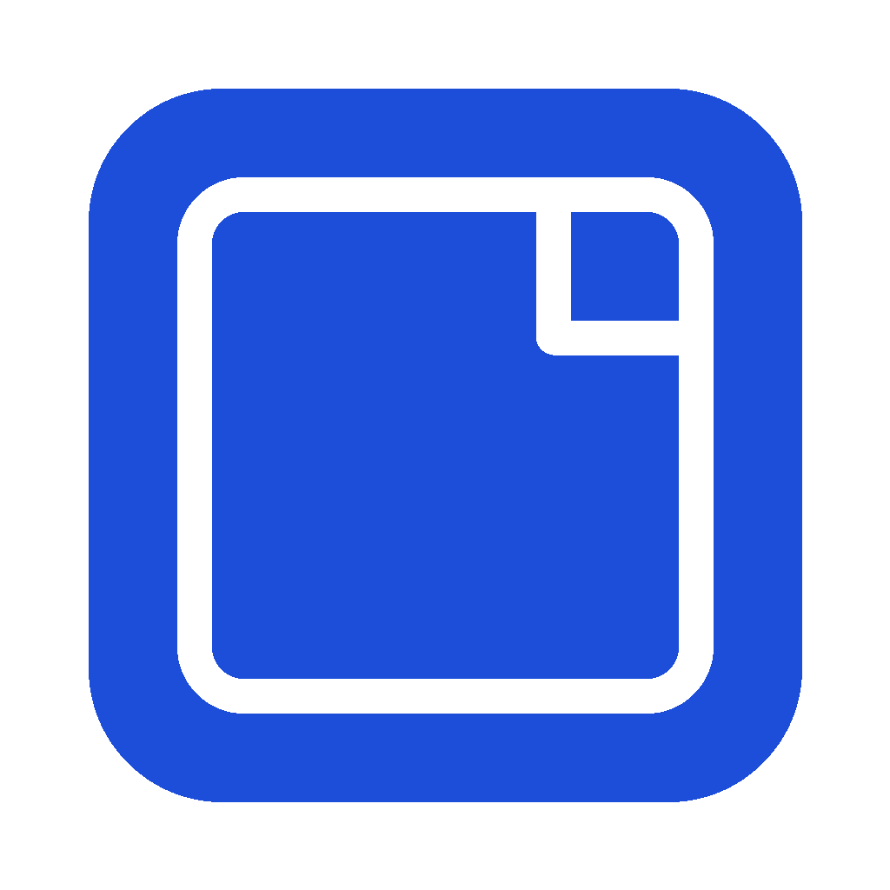

# MyScript

  

**MyScript is a desktop application designed to streamline the process of recording scripted content like tutorials, presentations, or voiceovers. It acts as a smart teleprompter, using real-time speech transcription to automatically track your progress through your script as you speak.**

## The Problem

Have you ever tried recording a tutorial or reading a script, only to lose your place constantly? Switching between your script and your recording software, trying to follow along, breaks your flow and makes recording tedious. MyScript was built to solve exactly this problem.

## Key Features

*   **Real-time Script Tracking:** The core feature! Start recording your voice, and MyScript transcribes it in real-time, automatically highlighting or advancing through your script so you always know your place.
*   **Notion Integration:** Connect your Notion account to easily fetch your pages and use them directly as scripts within the app.
*   **Local Notion-Like Editor:** Prefer to write or edit locally? MyScript includes a built-in editor with a familiar block-style interface.
    *   *(Planned/Included)* AI Features: Enhance your scripts with AI-powered text generation, improvement suggestions, etc. (Specify if this is already implemented or planned).
*   **Multiple Transcription Options:** Choose the best fit for your needs:
    *   **Remote OpenAI Whisper:** High accuracy transcription using the OpenAI API (Requires your own API key).
    *   **Local Whisper:** Run Whisper directly on your machine for privacy and offline use (Requires setup, performance depends on your hardware).
    *   **Groq Whisper:** Leverage Groq's fast Whisper API implementation (Requires a Groq API key).
    *   **Wit.ai:** A free, cloud-based option (Requires internet, no user API key needed, potentially less accurate than Whisper).
*   **Google Drive Sync:** Securely back up your local scripts and application configuration to Google Drive. Synchronize your data across multiple devices where you use MyScript.
*   **Cross-Platform:** Built with Wails, aiming for compatibility with Windows, macOS, and Linux.

## Screenshots

*   [Screenshot 1: Main interface showing script and tracking]
*   [Screenshot 2: Notion integration view]
*   [Screenshot 3: Local editor]
*   [Screenshot 4: Settings/Transcription options]

## Technology Stack

*   **Backend:** Go
*   **Frontend:** ReactJS
*   **Framework:** Wails (v2)
*   **Transcription Engines:** OpenAI Whisper API, Local Whisper (via bindings like `whisper.cpp`), Groq API, Wit.ai API

## Installation

**Build Steps (adjust as needed):**

1.  Ensure you have Go, Node.js, and the Wails CLI installed. (See [Wails prerequisites](https://wails.io/docs/gettingstarted/installation#prerequisites))
2.  Clone the repository: `git clone https://github.com/paradoxe35/myscript.git`
3.  Navigate to the project directory: `cd myscript`
4.  Build the application: `make build`
5.  Find the executable in the `build/bin` directory.

**(Alternatively, download the prebuild here [release](https://github.com/paradoxe35/myscript/releases/latest))**

## Configuration

Upon first launch or via the settings menu, you may need to configure:

*   **Notion Integration:** Authorize access to your Notion account.
*   **Transcription Services:**
    *   Enter your API key for OpenAI Whisper or Groq.
    *   Configure paths or settings for Local Whisper if applicable.
    *   Wit.ai typically requires no user-specific keys.
*   **Google Drive Sync:** Authorize access to your Google Drive account.

## Usage

1.  **Load/Write Script:** Fetch a page from Notion or create/edit a script using the local editor.
2.  **Select Transcriber:** Choose your preferred transcription engine from the settings.
3.  **Start Recording:** Hit the record button. The application will start listening to your microphone.
4.  **Speak Clearly:** As you read your script, MyScript will transcribe your speech and visually track your progress within the script view.
5.  **Stop Recording:** Stop when finished.

## Contributing

Contributions are welcome! Please feel free to submit pull requests or open issues for bugs, feature requests, or improvements.

## License

This project is licensed under the MIT License - see the [LICENSE](LICENSE) file for details.

---

We hope MyScript improves your recording workflow!
