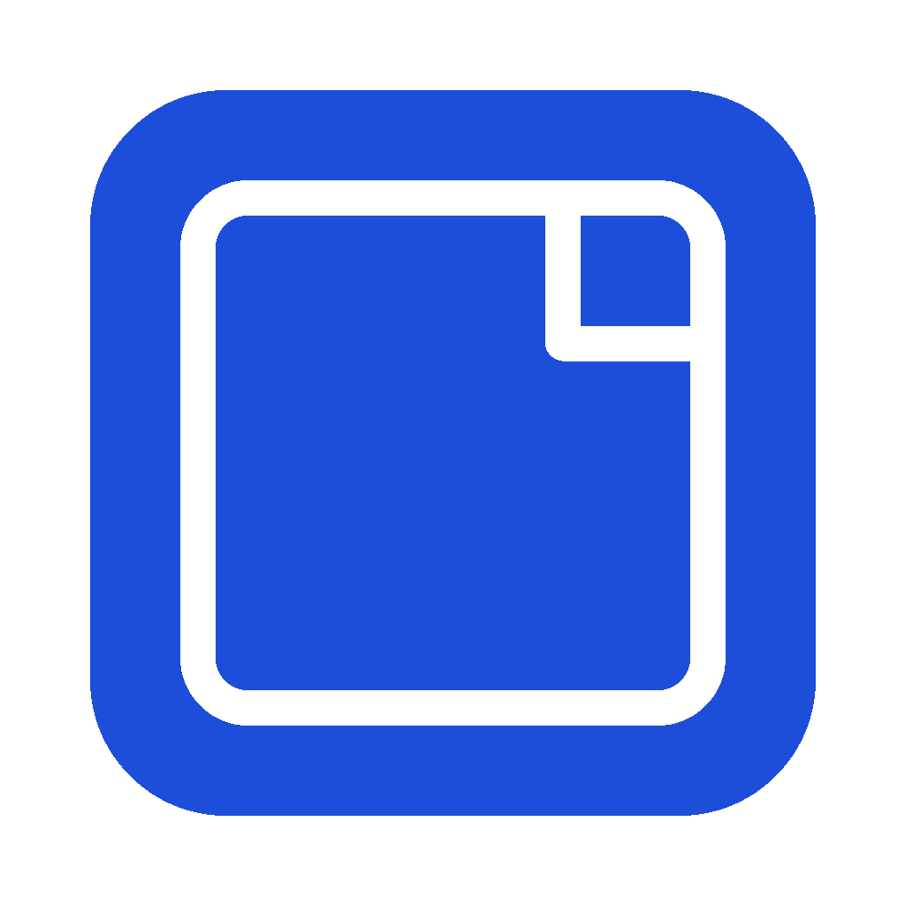

# MyScript

  

**MyScript is a desktop application designed to streamline the process of recording scripted content like tutorials, presentations, or voiceovers. It acts as a smart teleprompter, using real-time speech transcription to automatically track your progress through your script as you speak.**

## The Problem

Have you ever tried recording a tutorial or reading a script, only to lose your place constantly? Switching between your script and your recording software, trying to follow along, breaks your flow and makes recording tedious. MyScript was built to solve exactly this problem.

## Key Features

*   **Real-time Script Tracking:** The core feature! Start recording your voice, and MyScript transcribes it in real-time, automatically highlighting or advancing through your script so you always know your place.
*   **Notion Integration:** Connect your Notion account to easily fetch your pages and use them directly as scripts within the app.
*   **Local Notion-Like Editor:** Prefer to write or edit locally? MyScript includes a built-in editor with a familiar block-style interface.
    *   **AI writing assistant:** Select text and ask AI to improve it, fix the grammar, make it shorter or longer, continue writing, or follow your own instruction. Answers stream in as they are written.
*   **Bring your own AI provider:** OpenAI, Claude and Gemini are built in, and you can add any OpenAI-compatible endpoint — Ollama, LM Studio, OpenRouter, vLLM or a company gateway. Each provider keeps its own key and model, and the model list is fetched from the provider itself.
*   **Multiple Transcription Options:** Choose the best fit for your needs:
    *   **Remote OpenAI Whisper:** High accuracy transcription using the OpenAI API (Requires your own API key).
    *   **Local models:** Run speech recognition directly on your machine for privacy and offline use. Models (Whisper, Parakeet, Moonshine and more, in GGUF form) are downloaded from the in-app catalogue, which ranks them for your hardware.
    *   **Groq Whisper:** Leverage Groq's fast Whisper API implementation (Requires a Groq API key).
    *   **Wit.ai:** A free, cloud-based option (Requires internet, no user API key needed, potentially less accurate than Whisper).
*   **Google Drive Sync:** Securely back up your local scripts and application configuration to Google Drive. Synchronize your data across multiple devices where you use MyScript.
*   **Cross-Platform:** Built with Wails, aiming for compatibility with Windows, macOS, and Linux.

## Screenshots

*   [Screenshot 1: Main interface showing script and tracking]
*   [Screenshot 2: Notion integration view]
*   [Screenshot 3: Local editor]
*   [Screenshot 4: Settings/Transcription options]

## Technology Stack

*   **Backend:** Go
*   **Frontend:** ReactJS
*   **Framework:** Wails (v2)
*   **Speech capture and local recognition:** Rust static library (`rust-ffi/`) built on `transcribe-cpp` (ggml), `cpal` and `earshot`, linked into Go through cgo
*   **Transcription Engines:** local GGUF models, OpenAI Whisper API, Groq API, Wit.ai API
*   **AI Providers:** OpenAI, Anthropic and Gemini APIs, plus any OpenAI-compatible endpoint

## Installation

**Build Steps (adjust as needed):**

1.  Ensure you have Go, Node.js with pnpm, the Wails CLI, a Rust toolchain, CMake and a C++ compiler installed. (See [Wails prerequisites](https://wails.io/docs/gettingstarted/installation#prerequisites)). On Linux also install `libasound2-dev`.
2.  Clone the repository: `git clone https://github.com/paradoxe35/myscript.git`
3.  Navigate to the project directory: `cd myscript`
4.  Build the application: `make build` (this first builds the Rust speech library into `lib/`; `make build-rust` rebuilds it alone)
5.  Find the executable in the `build/bin` directory.

Run `make test` to run the Rust, Go and frontend checks.

**(Alternatively, download the prebuild here [release](https://github.com/paradoxe35/myscript/releases/latest))**

## Configuration

Settings are grouped by what they do:

*   **Speech:** choose where transcription runs. A local model needs no key — pick one from the catalogue, which ranks models by how well they run on your machine. OpenAI Whisper and Groq each take their own API key; Wit.ai takes none.
*   **AI:** set up the providers for the writing assistant. Pick the active one, paste its key, and either type a model name or browse what the provider offers. "Add" registers any OpenAI-compatible endpoint, including local ones that need no key at all.
*   **Notion:** paste an internal integration token, then share the pages you want to read with that integration.
*   **Backup:** authorize Google Drive to back up and sync your scripts.

### Where your credentials are kept

API keys are stored encrypted, in a database separate from the one that syncs to Google Drive, so they stay on the machine you entered them on. Settings that are not secret — which provider is active, base URLs, model names — do sync, so a second device only needs its keys. Keys written by earlier versions are moved into that store automatically the first time you launch this one.

## Usage

1.  **Load/Write Script:** Fetch a page from Notion or create/edit a script using the local editor.
2.  **Select Transcriber:** Choose your preferred transcription engine from the settings.
3.  **Start Recording:** Hit the record button. The application will start listening to your microphone.
4.  **Speak Clearly:** As you read your script, MyScript will transcribe your speech and visually track your progress within the script view.
5.  **Stop Recording:** Stop when finished.

## Contributing

Contributions are welcome! Please feel free to submit pull requests or open issues for bugs, feature requests, or improvements.

## License

This project is licensed under the MIT License - see the [LICENSE](LICENSE) file for details.

---

We hope MyScript improves your recording workflow!
